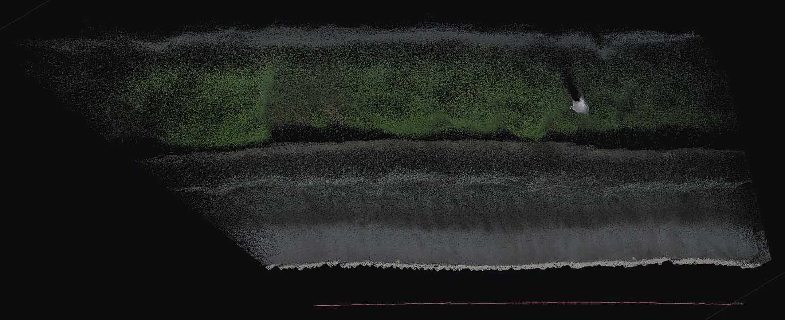
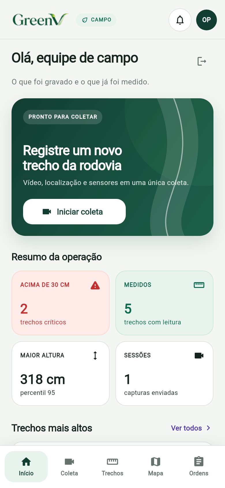
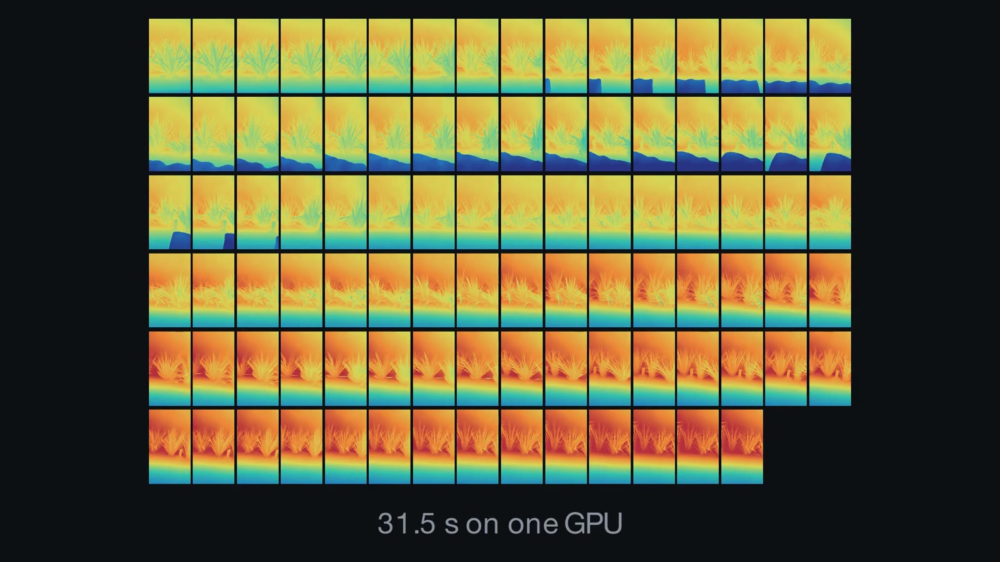
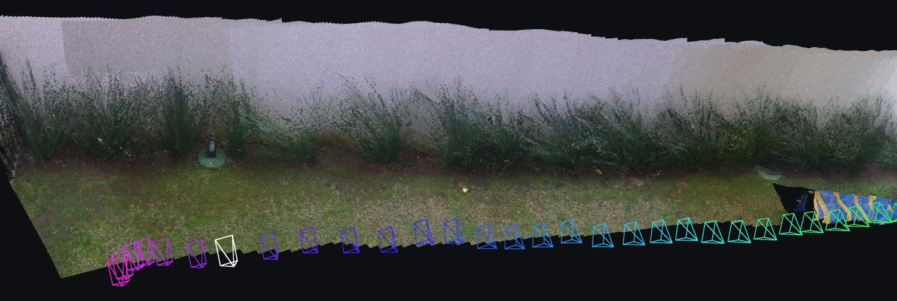
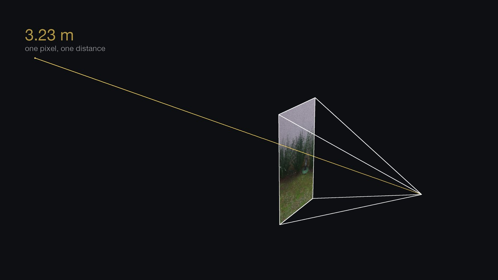
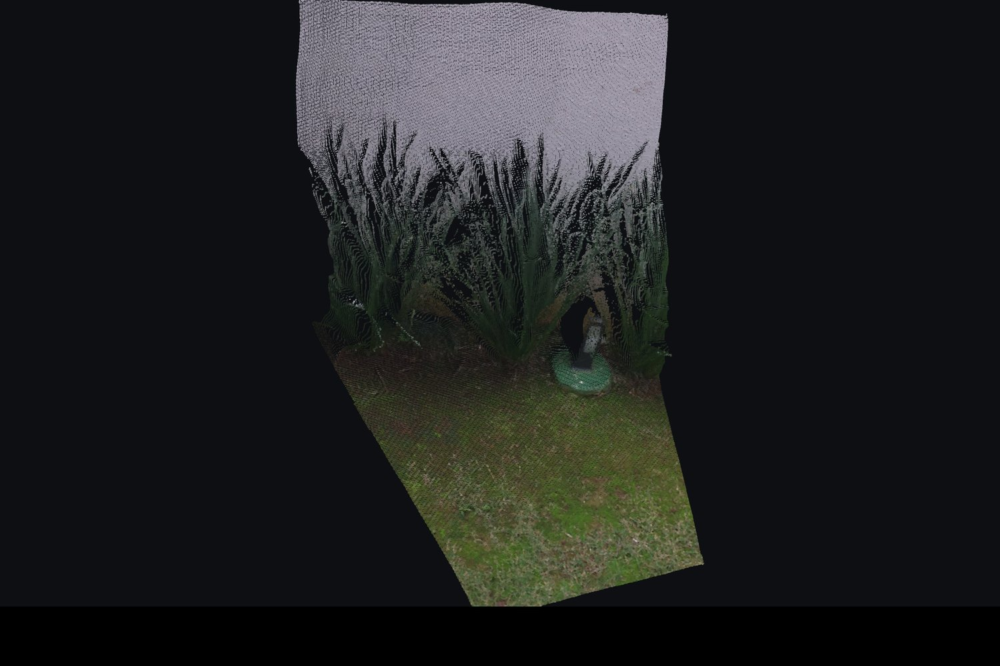
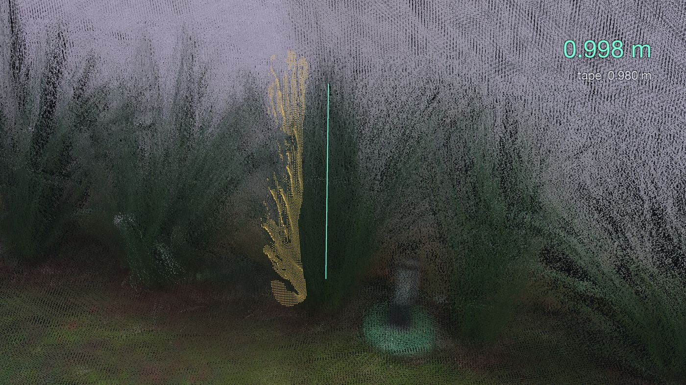
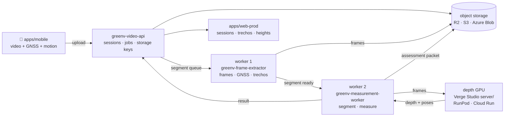

<div align="center">


**Finds the roadside vegetation that needs mowing first — from a phone in a moving vehicle.**

Built for the [Motiva](https://www.motiva.com.br) challenge · FIAP 2CCPW · group 27

[See it work](#see-it-work) · [How it works](#how-it-works) · [Architecture](#architecture) ·
[Run it](#run-it) · [Status](#status) · [Layout](#project-layout)

</div>

<p align="center">
  
</p>

<sub>One <i>trecho</i> of a real GreenV capture — session <code>01a09b15</code>, segment 1, window 00 —
as the deployed chain reconstructed it, seen from above. Vegetation along the top, the carriageway
below, the camera's own path in pink.</sub>

---

## The problem

A highway concessionaire decides where to send a *roçada* (mowing) crew with very little to go on:
someone drives the *rodovia*, looks at the verge, and writes it down. The growth that matters is
the growth that closes in on the shoulder, hides signs and blocks drainage — and it is spread over
hundreds of kilometres that nobody can watch continuously.

**GreenV turns an ordinary drive into that decision.** A phone mounted in a vehicle records the
route with GNSS and motion telemetry. The video is cut into georeferenced *trechos* (road
stretches), a depth model reconstructs each one in three dimensions, and the vegetation is measured
in metres against a fitted ground plane. The result is a map of stretches ranked by how urgently a
crew is needed, with the frame each decision came from attached to it.

## See it work

<table>
<tr>
<td width="50%" valign="top"><b>1 · Capture.</b> The Flutter client records video, GNSS and motion
together and keeps each capture in a restart-safe queue on the device until the API has accepted
it — a dead zone on the <i>rodovia</i> costs a delay, not a capture.</td>
<td width="50%" align="center"><br><sub>Presentation preview build — the numbers are placeholder data.</sub></td>
</tr>
<tr>
<td valign="top"><b>2 · Reconstruct.</b> Frames go to a depth model <b>together</b>, not one at a
time, so every pixel comes back with a distance <i>and</i> the camera's own position is recovered.
That is what makes the geometry metric without anything in the scene saying what a metre is.</td>
<td></td>
</tr>
<tr>
<td valign="top"><b>3 · Measure.</b> Each frame is placed by its recovered camera pose, so the
frames land in one coordinate system without stitching. Vegetation is measured against the fitted
ground in half-metre cells along the road.</td>
<td></td>
</tr>
<tr>
<td valign="top"><b>4 · Prioritise.</b> The dashboard draws each session where it was driven and
lists its <i>trechos</i> — windows of about 25 m, each with its own measured height — tallest
first, with the photo behind every point.</td>
<td><!-- screenshot: apps/web-prod trecho list --><i>screenshot pending</i></td>
</tr>
</table>

<sub>Every reconstruction on this page is a real run of this pipeline, as in
[Verge Studio's README](measurement/README.md); nothing is an illustration. App screenshots say
where their data comes from.</sub>

## How it works

The measurement engine is **[Verge Studio](measurement/README.md)**, developed on its own and
carried here as a git subtree. Its README explains the geometry step by step; the short version:

<table>
<tr>
<td width="50%"></td>
<td>A photograph throws away one number per pixel: how far away the light started. The depth model
gives it back. <b>The pixel fixes the direction; the depth says where along that ray to stop.</b>
That is one 3D point — three lines of arithmetic in
<a href="measurement/geometry/backproject.ts"><code>backproject.ts</code></a>.</td>
</tr>
<tr>
<td></td>
<td>Do it for every pixel and one frame becomes a surface — the shape of the scene, with holes
wherever something was hidden.</td>
</tr>
<tr>
<td></td>
<td>Fit the ground to find "up", select the vegetation, read its extent. Taped at <b>0.980 m</b>,
read at <b>0.998 m</b>. That reading used a hand-painted mask in a garden — see
<a href="#status">Status</a> for what has <i>not</i> been graded.</td>
</tr>
</table>

Everything except the depth model's forward pass runs on a CPU and costs nothing. The forward pass
needs a GPU, and that is the only part of the system that bills.

## Architecture



Workers talk through a queue that can be RabbitMQ, Amazon SQS, Azure Queue Storage or Azure
Service Bus, and store objects locally, on S3-compatible storage or on Azure Blob — without
changing application code. Worker 2 calls Verge Studio as a **process** and reads JSON back; nothing
imports across that boundary, which is what lets the subtree keep developing independently.

Every hop, every setting and the deployed topology are in
[`infrastructure/README.md`](infrastructure/README.md). The chain itself, and what it does not
establish, is [`docs/AUTOMATIC-HEIGHT.md`](docs/AUTOMATIC-HEIGHT.md).

## Run it

The whole backend, locally — PostgreSQL, RabbitMQ, the API and both workers:

```bash
docker compose up --build
```

The API answers on `127.0.0.1:8080`. One end-to-end check of the stack:

```bash
docker compose --profile test up --build capture-smoke
```

The dashboards are npm workspaces, installed once from the root:

```bash
npm install
npm run dev --workspace @greenv/web-mock    # the demo: Motiva's KMZ polygons, invented orders
npm run dev --workspace @greenv/web-prod    # the real client, against the API
```

Everything else lives beside the code it describes:

| To… | Read |
|---|---|
| Build or run the capture app | [`apps/mobile/README.md`](apps/mobile/README.md) |
| Run or configure the API | [`services/greenv-video-api/README.md`](services/greenv-video-api/README.md) |
| Understand frame sampling and *trechos* | [`services/greenv-frame-extractor/README.md`](services/greenv-frame-extractor/README.md) |
| Measure a segment automatically | [`services/greenv-measurement-worker/README.md`](services/greenv-measurement-worker/README.md) |
| Run the depth stage on a GPU | [`services/greenv-depth-runpod/README.md`](services/greenv-depth-runpod/README.md) |
| Deploy the cloud stack | [`infrastructure/README.md`](infrastructure/README.md) |
| Measure heights by hand, in 3D | [`measurement/README.md`](measurement/README.md) |
| Change anything | [`AGENTS.md`](AGENTS.md) — the working agreement |

## Status

**The chain runs end to end.** On 11 September 2026 four segments went from upload to measurement
in the deployed Azure stack, against a live RunPod GPU, at 3.4 to 24.8 GPU-seconds each, with
nobody touching them.

**It is not yet an operations tool, and it says so itself.** `apps/web-prod` already lists every
measured *trecho* with its height, tallest first. Two gaps stand between that list and a crew
being sent:

- **No automatic reading has been graded against a tape.** Every tape-graded measurement in the
  project used a hand-painted mask; the automatic chain has none. Every packet it produces carries
  `operationalStatus: "not-ready"`, and Verge Studio's verifier fails if it ever says otherwise.
- **A measurement has no `km`.** Without a highway linear reference it cannot be placed on the
  *rodovia*, so packets raise `road-metadata-missing` rather than guess.

The demo, `apps/web-mock`, is separate and stays on fixtures by design: Motiva's 642 KMZ polygons,
with levels from a spreadsheet rather than from anything this system measured.

**[`docs/STATE-OF-THE-SYSTEM.md`](docs/STATE-OF-THE-SYSTEM.md) is the full inventory** — what runs,
what is written but has never executed, and the gaps ranked by what they cost. Read it before
trusting any other document here about a part it does not own.

## Project layout

```
apps/
  mobile/                     capture client: video + GNSS + motion, offline-first    Flutter
  web-core/                   what both dashboards share; knows no data source        React 18
  web-mock/                   the demo: KMZ polygons, invented orders                 React 18, Vite, Leaflet
  web-prod/                   the real client: sessions, trechos, heights             React 18, Vite, Leaflet
services/
  greenv-video-api/           the control plane: sessions, jobs, keys                 Spring Boot, Java 21
  greenv-frame-extractor/     worker 1: frames, GNSS, trechos                         Spring Boot, Java 21, ffmpeg
  greenv-measurement-worker/  worker 2: reconstruct, segment, measure                 Node 22
  greenv-depth-runpod/        the depth stage as a serverless GPU job                 Python 3.12, Docker
  capture-smoke/              one end-to-end check of the compose stack               Shell, Docker
measurement/                  Verge Studio: metric height from video; a subtree       TypeScript, Python
infrastructure/               the scale-to-zero cloud MVP                             Terraform
docs/                         system state, the automatic-height chain, infra options
compose.yaml                  the local stack                                         Docker Compose
```

## Tech stack

Flutter · Spring Boot on Java 21 · Node 22 · React 18, Vite and Leaflet · Three.js · Python 3.12
and FastAPI · Depth Anything 3 · PostgreSQL · RabbitMQ · Docker Compose · Terraform on Azure,
Cloudflare R2 and Neon · RunPod and Google Cloud Run GPUs

## Team

FIAP 2CCPW, group 27:

- Helena Barbosa Costa
- Henrique Mandrick
- Mateus Scandiuzzi Valente Tomomitsu
- Ryan Amorim de Castro Santana
- Thomas Joh Kobayashi

---

<sub>The depth model used by `measurement/` is licensed for **personal and research use only** —
fine for a pilot, not for a concessionaire, and unresolved. The GPU service it runs on bills for
the machine's whole lifetime, not for the seconds it computes.</sub>
